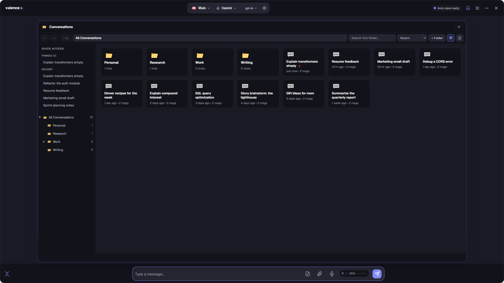

# Valence

**A private, controlled, curated AI space** — every AI model you use, local or cloud, on your terms.

[Website](https://helixailabs.com) · [Updates](https://helixailabs.github.io/Valence/updates/) · [All releases](https://github.com/HelixAILabs/Valence/releases) · [Research](https://helixailabs.github.io/Valence/research/) · help@helixailabs.com

---

## ⬇ Download

**Slim — right for most people** (needs internet once, during setup):

**[Download Valence 1.4.0 slim (.msi)](https://github.com/HelixAILabs/Valence/releases/download/v1.4.0/Valence-1.4.0-slim.msi)**

Windows 10/11 (64-bit) · 302.83 MB · 7-day free trial, then **$59.95 once** · fully offline after setup · no subscription

> **SHA-256:** `0C507161CB4CAB88081E0DC136F681BE26C3D68C433FD428CF98671149BFC5B2`

**All-in-one — for offline / locked-down machines** (every backend bundled, nothing to fetch):

**[Download Valence 1.4.0 (.msi)](https://github.com/HelixAILabs/Valence/releases/download/v1.4.0/Valence-1.4.0.msi)**

Windows 10/11 (64-bit) · 808.68 MB

> **SHA-256:** `B32F874DA5442D5BC75AE35D73F90EAE6FA744DF32C541583CC943307805F0BF`
> Both installers are unsigned, so Windows SmartScreen may warn you — click **More info → Run anyway**. Existing installs upgrade in place (and keep their flavor).

### Which download?

The lighter install we promised is here. **Slim** takes one quick look at your hardware during setup and downloads only the graphics acceleration your machine actually uses — NVIDIA gets CUDA, AMD and Intel get Vulkan, and a CPU-only machine needs nothing extra at all. **All-in-one** still ships every backend in the box for machines that can't (or shouldn't) touch the network during setup.

| | Slim | All-in-one |
|---|---|---|
| Download size | 302.83 MB | 808.68 MB |
| Graphics backends | fetched for your card | all bundled |
| Internet at setup | once | never |
| Works offline after | yes | yes |
| Privacy | 100% local | 100% local |

Either way, everything — your conversations, models, and memory — runs on your machine and never phones home.

---

## What is Valence?

A private, controlled, curated space for working with AI — local or cloud, all under your control.

- **Curated, cross-model** — OpenAI, Anthropic, Google, Azure, xAI, OpenRouter, Ollama, and on-device local models, all from one interface.
- **Private by design** — conversations, memory, and documents stay on your computer. No account required.
- **Fully local option** — download a model (Gemma, Qwen, …) and chat with nothing leaving your PC.
- **You're in control** — local memory you own, per-profile knowledge from your own documents, model compare, and X-Ray ("why did it answer that?").
- **Kids Mode** — a locked-down chat for children with a parent dashboard, on-device safety, and daily time limits.

---

## Releases

| Version | Date | Summary |
|---------|------|---------|
| **[1.4.0](https://helixailabs.github.io/Valence/2026/07/19/valence-1-4-0.html)** &nbsp;_(latest)_ | Jul 19, 2026 | Kids privacy & safety - deny-by-default Kids Mode, a 988 crisis guarantee, at-rest encryption + a Local-Only switch, a parent console - plus a calmer, more honest experience: calm streaming, friendly model names, honest first-run/GPU, and a collapsed Chain of Thought. |
| **[1.3.2](https://helixailabs.github.io/Valence/2026/07/06/valence-1-3-2.html)** | Jul 6, 2026 | Smoother updates: installing an update no longer shows a false "download failed" error (the install always worked; the message did not). |
| **[1.3.1](https://helixailabs.github.io/Valence/2026/07/06/valence-1-3-1.html)** | Jul 6, 2026 | A small polish fix: the badge explainer now shows a single Got-it button. |
| **[1.3.0](https://helixailabs.github.io/Valence/2026/07/06/valence-1-3-0.html)** | Jul 6, 2026 | The slim installer debuts (302.62 MB — fetches only the acceleration your card uses) beside the all-in-one; a reimagined, guided first run; the "Your AI" status badge; offline local-model sends fixed; update integrity checks. |
| **[1.2.3](https://helixailabs.github.io/Valence/2026/07/03/valence-1-2-3.html)** | Jul 3, 2026 | AI Providers redesigned: provider chips with status dots, one-line model library table, Gemma vs Qwen comparison table. |
| **[1.2.2](https://helixailabs.github.io/Valence/2026/07/03/valence-1-2-2.html)** | Jul 3, 2026 | Theme-matched ink for loading effects (indigo/sepia/ocean/coral per light theme); settings navigation overhaul (chip views, sections open, compact header on small windows); Growing Tree blossoms softened; appearance-control responsiveness fix. |
| **[1.2.1](https://helixailabs.github.io/Valence/2026/07/03/valence-1-2-1.html)** | Jul 3, 2026 | Ink-on-paper loading effects on light themes: all 16 effects (and the classic spiral backdrop) adapt automatically; local-model fixes (no more instruction echo; quoted ability syntax stays on screen). |
| **[1.2.0](https://helixailabs.github.io/Valence/2026/07/03/valence-1-2-0.html)** | Jul 3, 2026 | Streaming Reveal: choose how replies stream in (None / Focus Pull / Weight Settle / Line Rise) with a live preview under Settings > Theme; update checks on by default; menu keyboard-navigation fix. |
| **[1.1.2](https://helixailabs.github.io/Valence/2026/06/29/valence-1-1-2.html)** | Jun 29, 2026 | Memory browser revamp: a roomier anchored Memory window with stats + sparkline, a facet rail (All / Recent / topics), live search + date range, and a slide-in editor drawer; plus a fix so selecting Local Model before downloading a model no longer throws a false "no API key" error. |
| **[1.1.1](https://helixailabs.github.io/Valence/2026/06/28/valence-1-1-1.html)** | Jun 28, 2026 | Math renders (LaTeX/KaTeX) everywhere the AI shows its work; smoother "watch it think, then publish" streaming; the generating indicator now sits under your message; plus currency-safe math and an automatic update refresh. |
| **[1.1.0](https://helixailabs.github.io/Valence/2026/06/28/valence-1-1-0.html)** | Jun 28, 2026 | Conversation Explorer: real disk-mirrored folders replacing the side list, grid + sortable table views (tags, model, message count), peek, conversation tagging, and per-message model attribution. |
| **[1.0.5](https://helixailabs.github.io/Valence/2026/06/27/valence-1-0-5.html)** | Jun 27, 2026 | Smoother updates: the startup update prompt now appears, a robot animation shows the download, and old installers are cleaned up automatically. |
| **[1.0.4](https://helixailabs.github.io/Valence/2026/06/27/valence-1-0-4.html)** | Jun 27, 2026 | Lens and X-Ray reimagined as clean anchored windows over the canvas, plus a custom-lens authoring fix. |
| **[1.0.3](https://helixailabs.github.io/Valence/2026/06/26/valence-1-0-3.html)** | Jun 26, 2026 | Local AI on AMD & Intel GPUs (Vulkan) with CPU fallback, one-click in-app purchase, smarter defaults, and an in-app update fix. |
| **[1.0.2](https://helixailabs.github.io/Valence/2026/06/26/valence-1-0-2.html)** | Jun 26, 2026 | Interface polish, friendlier first-run, Ollama installed-model listing, manual Check for Updates, NVIDIA driver guidance. |
| **[1.0.1](https://helixailabs.github.io/Valence/2026/06/23/valence-1-0-1.html)** | Jun 23, 2026 | Installer packaging fix — bundles the complete app asset set. |
| **[1.0.0](https://helixailabs.github.io/Valence/2026/06/22/valence-1-0-0.html)** | Jun 22, 2026 | First public release. |

Full notes for every version live on **[Updates](https://helixailabs.github.io/Valence/updates/)**.

---

© 2026 Helix AI Labs · <a href="https://helixailabs.com">helixailabs.com</a> · help@helixailabs.com

